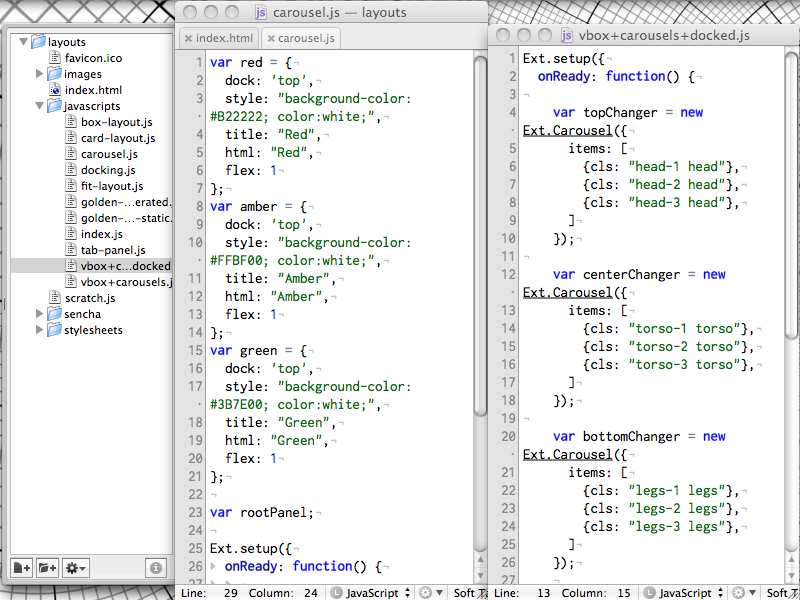
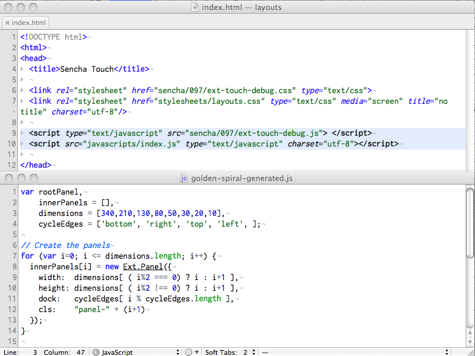
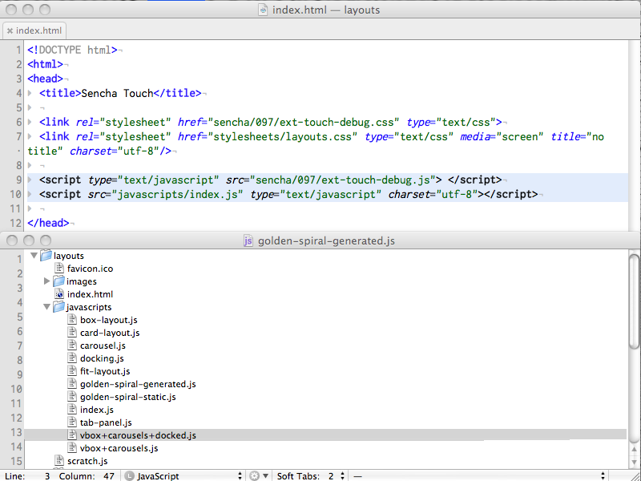
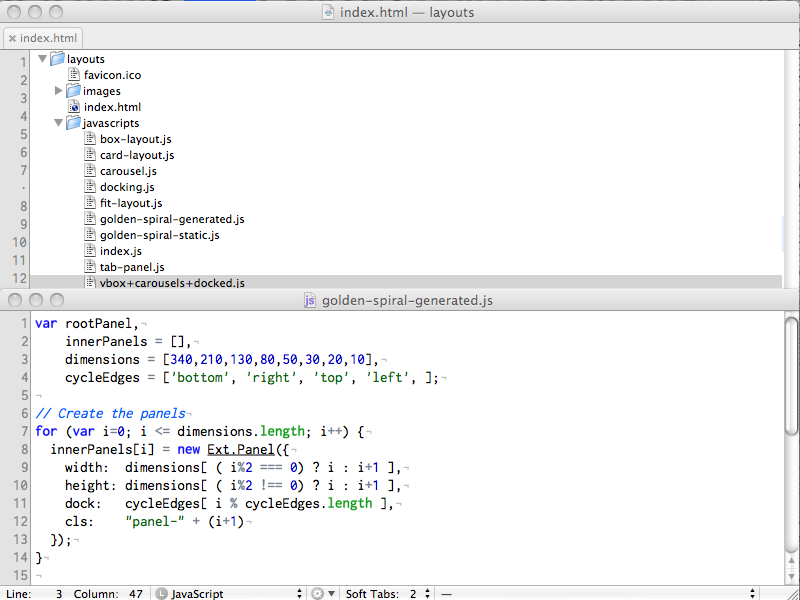
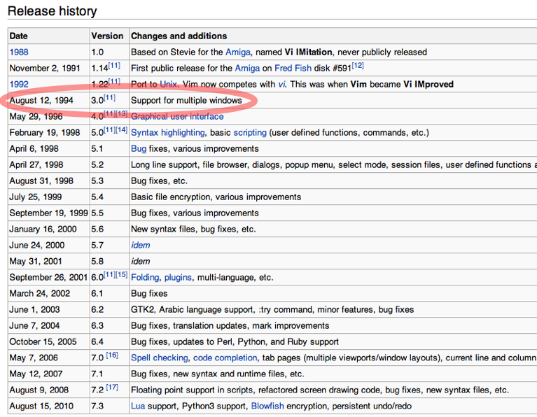
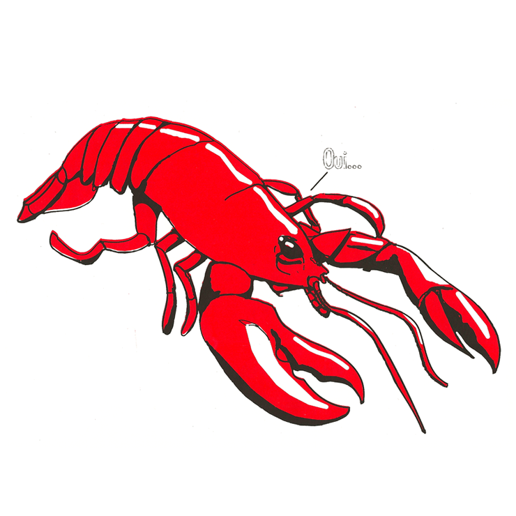

!SLIDE

# CRUTCHES

!SLIDE center

!SLIDE

## NERD Tree

!SLIDE center

!SLIDE center

!SLIDE center

!SLIDE center

!SLIDE center

!SLIDE center

!SLIDE center

!SLIDE center

!SLIDE center

!SLIDE

# INDENTATION

!SLIDE bullets

## TextMate

*  ⌘] - indent
*  ⌘[ - outdent

!SLIDE
### demo

!SLIDE bullets

## Vim

* `>` - indent
* `<` - outdent

!SLIDE
### demo

!SLIDE bullets

* `vmap <D-]> >gv`
* `vmap <D-[> <gv`

!SLIDE

## CODE SMELL?

!SLIDE
### demo

!SLIDE bullets

* `>..`
* `<..`

!SLIDE bullets incremental

##THE VIM WAY

* do it (`>`)
* repeat (`.`)
* reverse (`u`)

!SLIDE transition=scrollRight

## What is the collective noun
## for
# SURREALISTS?

!SLIDE center

!SLIDE center

!SLIDE transition=scrollLeft
