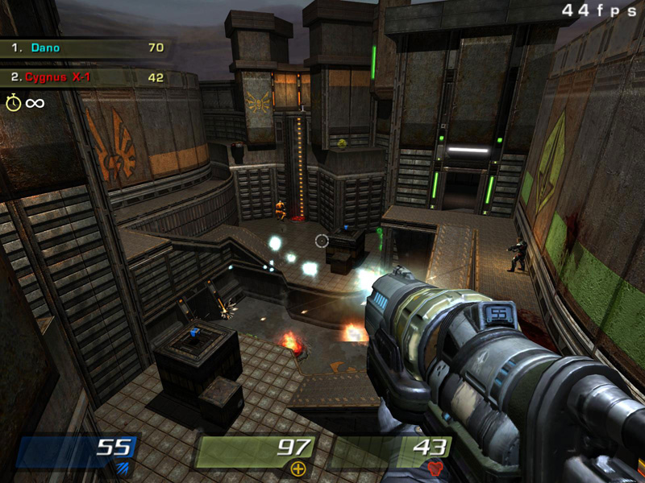
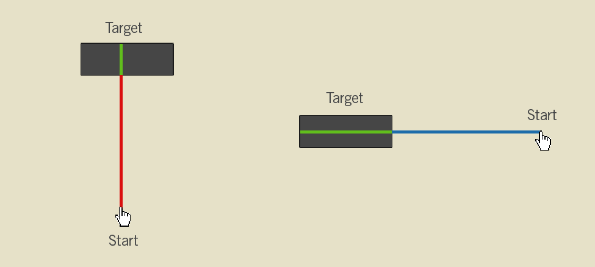
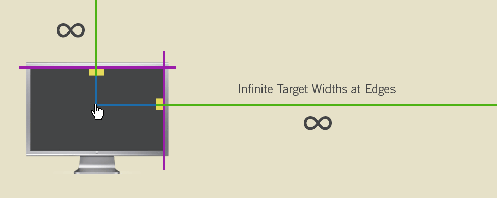
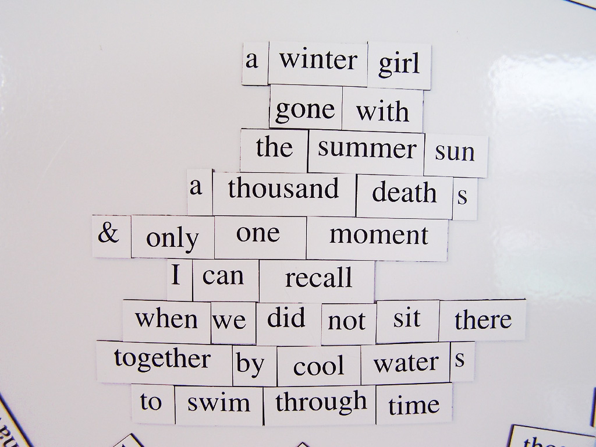
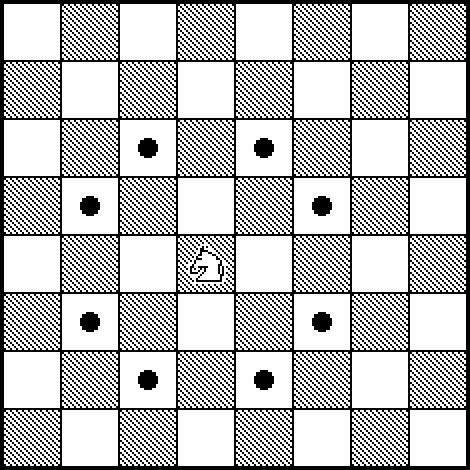
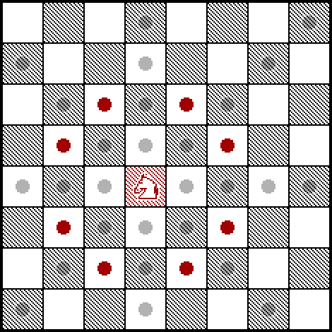

!SLIDE

# MOVING THE CURSOR

!SLIDE center

     

!SLIDE center

     

!SLIDE bullets

#FITT'S LAW

* the time required to rapidly move to a target area is a function of the distance to and the size of the target

!SLIDE center

     

!SLIDE center

## [duh]

!SLIDE center

     

!SLIDE center

     

!SLIDE center

     

!SLIDE center

     

!SLIDE

## HUNT & PECK

!SLIDE center

     

!SLIDE

## The Knight can move

### two squares along, then one square on the perpendicular axis

!SLIDE

## The Knight can move

### to the closest squares that no other piece can reach

!SLIDE center

     

!SLIDE center

     

!SLIDE center

     

