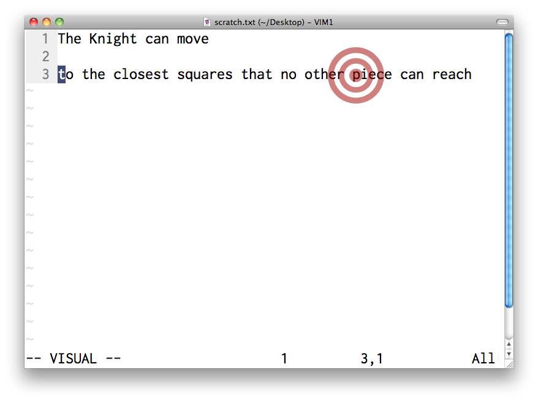
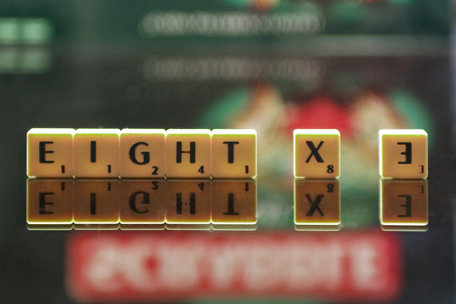
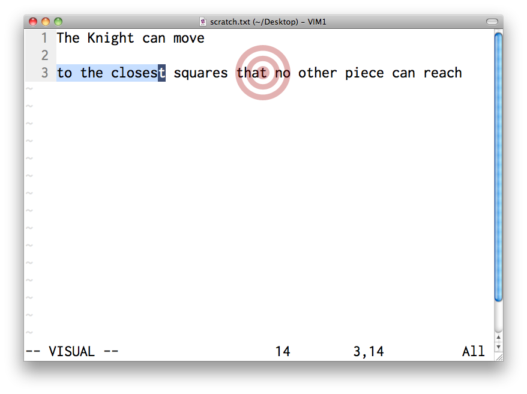
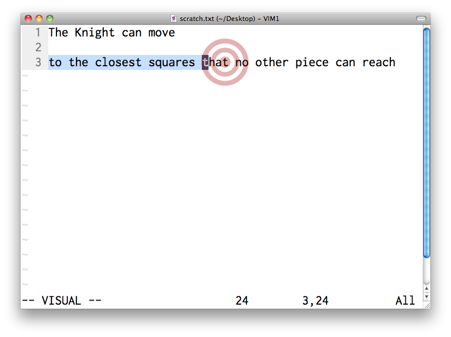
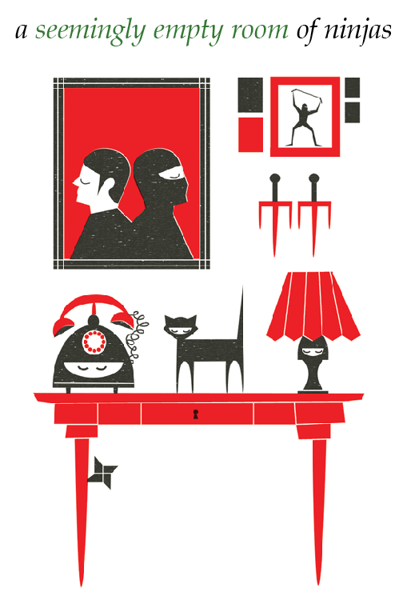

!SLIDE

# MOVING THE CURSOR

!SLIDE center

     

!SLIDE center

     

!SLIDE bullets

#FITT'S LAW

* the time required to rapidly move to a target area is a function of the distance to and the size of the target

!SLIDE center

     

!SLIDE center

## [duh]

!SLIDE center

     

!SLIDE center

     

!SLIDE center

     

!SLIDE center

     

!SLIDE

## HUNT & PECK

!SLIDE center

     

!SLIDE

## The Knight can move

### two squares along, then one square on the perpendicular axis

!SLIDE

## The Knight can move

### to the closest squares that no other piece can reach

!SLIDE center

     

!SLIDE center

     

!SLIDE center

     

!SLIDE

# FINDING CHARACTERS

!SLIDE bullets

# FINDING CHARACTERS

* `f{char}` jumps to next occurence of `{char}`

!SLIDE center

!SLIDE center

!SLIDE

# `fp`

!SLIDE center

!SLIDE center

!SLIDE center

!SLIDE

# `ft`

!SLIDE center

!SLIDE

# `;`

!SLIDE center

!SLIDE center

!SLIDE center

!SLIDE

# `ft;;;`

!SLIDE bullets incremental

##THE VIM WAY

* do it (`f{char}`)
* repeat (`;`)
* reverse (`,`)

!SLIDE bullets

# Besides mindreading

* use with `d{motion}`
* use with `c{motion}`

!SLIDE bullets

# Inclusive or exclusive

* `f/F` land on the match
* `t/T` stop one short of the match

!SLIDE

### demo

!SLIDE bullets

# LIMITATIONS
## `f{char}` 
## only works

* on current line
* for single characters

<!-- 
  searching for strings
  /
  n
   -->

!SLIDE bullets incremental

##THE VIM WAY

* do it (`/pattern`)
* repeat (`n`)
* reverse (`N`)

<!-- !SLIDE center

 -->

!SLIDE

## What is the collective noun
## for
# NINJAS?

!SLIDE center

!SLIDE center

