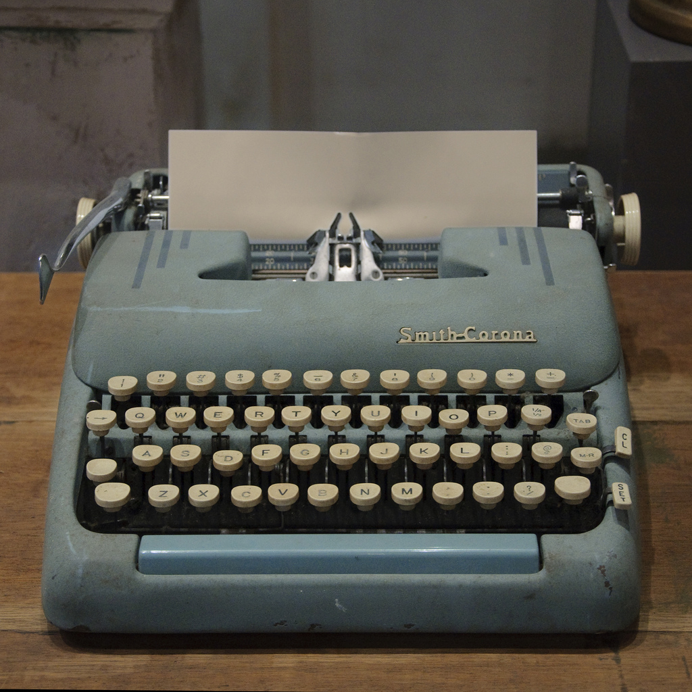
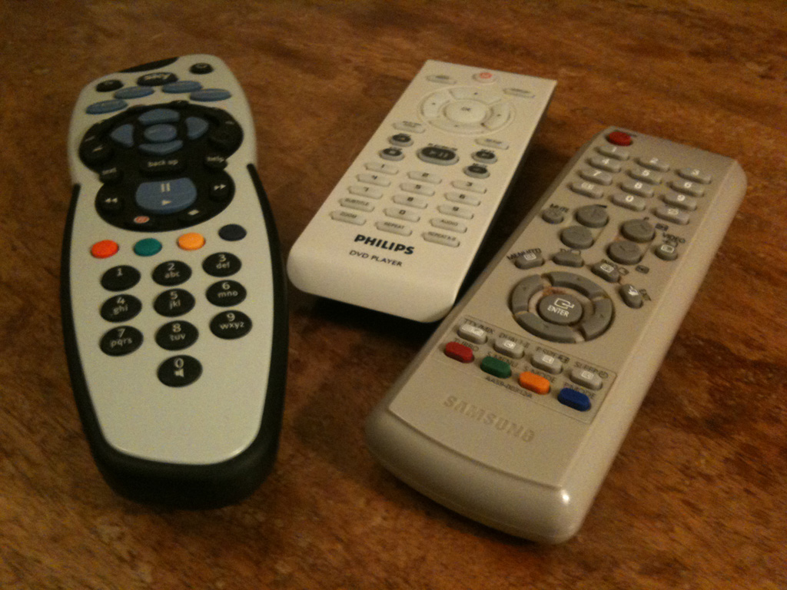
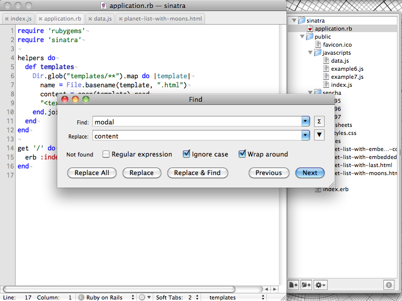

!SLIDE 

# MODAL INTERFACES

!SLIDE center

     

!SLIDE

## Incredulously:
### You mean, I have to **do X** before I can enter any text?

!SLIDE center

     

!SLIDE bullets

# MODAL INTERFACES

* are good

!SLIDE center

     

!SLIDE center

     

!SLIDE

## In a modal interface

### Every **button** performs a different function in each mode

!SLIDE

## In a touch interface

### Every **pixel** performs a different function in each mode

!SLIDE bullets

# MODAL INTERFACES

* are everywhere

!SLIDE bullets

# MODAL INTERFACES

* Safari - cmd-F

!SLIDE bullets

# MODAL INTERFACES

* TextMate - cmd-F

!SLIDE center

     

!SLIDE bullets

# MODAL INTERFACES

* TextMate - cmd-A

!SLIDE center

     

!SLIDE center

     

!SLIDE bullets incremental

# TEXTMATE 
## is a 
# MODAL EDITOR!

* not a very good one

!SLIDE bullets

# MODAL INTERFACES

* are everywhere

!SLIDE transition=scrollRight

## What is the collective noun
## for
# OPTIMISTS?

!SLIDE center

!SLIDE center

!SLIDE transition=scrollLeft
