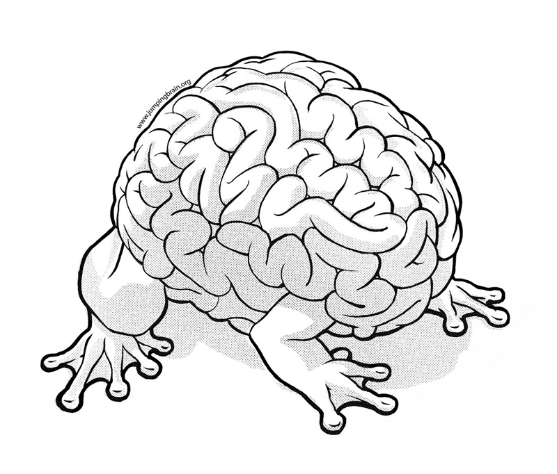

!SLIDE

# THINKING 
## and
# DOING

!SLIDE center

     

!SLIDE center

     

!SLIDE

# Models and Tests

!SLIDE bullets incremental

## Jump to test

* what is `current_model`?
*  ⌘T `crtmdtes`

!SLIDE

    rails_app/
      app/
        models/
          thing.rb
          other.rb
      spec/
        models/
          thing_spec.rb
          other_spec.rb
        

!SLIDE

## rails.vim

!SLIDE bullets

# `:A`

* jump to alternate file

!SLIDE
### demo

!SLIDE center

!SLIDE center

!SLIDE transition=scrollRight

## What is the collective noun
## for
# SURREALISTS?

!SLIDE center

!SLIDE center

!SLIDE transition=scrollLeft
